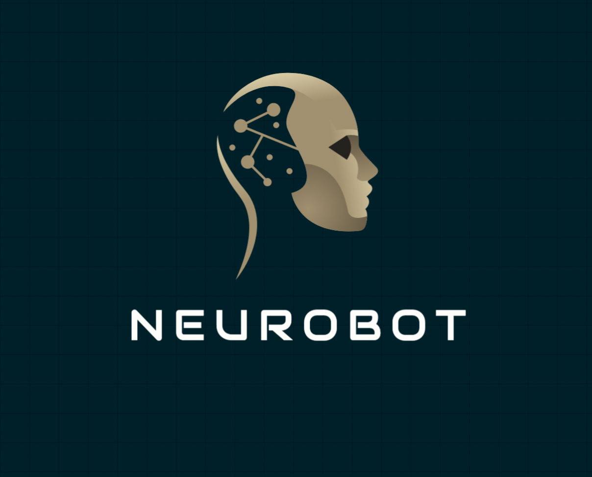

# Neurobot



## Overview

Employee.ai is a cutting-edge AI-powered platform that brings specialized virtual agents to your workforce. Designed to handle diverse roles, our AI agents are trained to perform complex tasks autonomously, streamlining operations, enhancing productivity, and reducing workload. Whether it's deploying a token onchain, funding wallets, generating tweets, posting, etc Employee.ai boosts productivity with intelligent, self-sufficient digital employees that work around the clock.

## Features

- **Onchain Agent:**  
  Onchain agents can help you carryout onchain actions such as buying a token, creating an NFT and lauching a smart contract.

- **Twitter manager:**  
  Tweets can also be created and published


## Architecture

Employee.ai is composed of three main stacks

1. **Frontend Stack:**

   - **Next.js:** User friendly interface to enable users chat with the ai.
   - **Privy Auth:** Used for authentication of users into the app.

2. **Agent Stack:**

   - **CDP AgentKit:** Provides the agents and a set of actions that can be plugged in to give the llm more capabilities

3. **API Stack:**

   - **Backend APIs:** Provides REST endpoints for frontend communication with the user's desired ai agent. Powered with Nest.js backend
   - **Deployment** Manages the wallet keys


## How It Works

1. **Email Reception:**  
   Incoming emails are received by AWS SES for the basemail.me domain. A receipt rule routes these emails to an S3 bucket.

2. **Email Processing:**  
   A dedicated Lambda function (the mail handler) retrieves the new email from S3, processes its contents, and invokes AI routines to summarize and elegantly format the email data.

3. **AI Enhancements:**  
   Using the Bedrock stack, emails are transformed into a rich, queryable knowledge base. This includes vector embeddings and semantic processing via Pinecone.

4. **Interactive Inbox:**  
   Users can interact with their inbox both via a traditional API and a WebSocket-enabled real-time chat interface. A voice-enabled agent further offers natural language interaction with email content.

## Getting Started

### Prerequisites

- **AWS Account:** Ensure you have an active AWS account with proper permissions.
- **AWS CDK:** Install and configure the AWS CDK.
- **Node.js:** Ensure Node.js and npm/yarn are installed.
- **Environment Variables:** Set the following variables in your deployment environment:
  - `CLERK_SECRET_KEY`
  - `DISCORD_WEBHOOK_URL`
  - `PINECONE_DB`
  - `PINECONE_SECRET_ARN`
  - _[Any others as needed]_

### Installation & Deployment

1. **Clone the repository:**

   ```bash
   git clone <repository-url>
   cd <repository-directory>
   ```

2. **Install dependencies:**

   ```bash
   npm install
   ```

3. **Bootstrap CDK (if needed) & deploy:**

   ```bash
   npx cdk bootstrap
   npx cdk deploy
   ```

   Deploy each stack as needed:

   - Basemail Mail Stack
   - Basemail API Stack
   - Basemail Bedrock Stack

## Usage

- **Email Functionality:**  
  Once deployed, simply use your basename (e.g., `john`) to access your personalized email inbox at `john@basemail.me`.

- **AI Interaction:**  
  Access summarized and formatted emails via our web API or use the voice agent for a conversational experience to query and interact with your emails.

- **Real-Time Updates:**  
  Connect via the provided WebSocket endpoint for live interaction and updates.

## Future Roadmap

- **Enhanced AI Models:**  
  Integrate additional machine learning models to further improve summarization and content extraction.

- **Voice Agent Improvements:**  
  Expand the voice-enabled functionality with advanced natural language processing and broader language support.

- **User Interface:**  
  Develop dedicated client applications (web and mobile) that fully leverage Basemail's backend capabilities.

## License

This project is released under the [MIT License](LICENSE).

## Acknowledgments

Developed as part of a 48-hour hackathon, Basemail is a demonstration of rapid prototyping combined with powerful AWS services and innovative AI integration.
