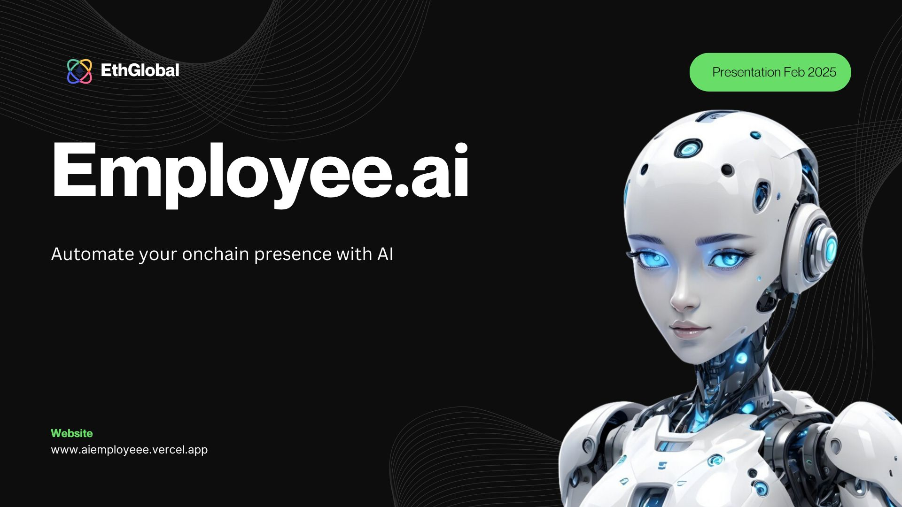

# Employee.ai



## Overview

Employee.ai is a cutting-edge AI-powered platform that brings specialized virtual agents to your workforce. Designed to handle diverse roles, our AI agents are trained to perform complex tasks autonomously, streamlining operations, enhancing productivity, and reducing workload. Whether it's deploying a token onchain, funding wallets, generating tweets, posting, etc Employee.ai boosts productivity with intelligent, self-sufficient digital employees that work around the clock.

## Features

- **Onchain Agent:**  
  Onchain agents can help you carryout onchain actions such as buying a token, creating an NFT and lauching a smart contract.

- **Twitter manager:**  
  Tweets can also be created and published


## Architecture

Employee.ai is composed of three main stacks

1. **Frontend Stack:**

   - **Next.js:** User friendly interface to enable users chat with the ai.
   - **Privy Auth:** Used for authentication of users into the app.

2. **Agent Stack:**

   - **CDP AgentKit:** Provides the agents and a set of actions that can be plugged in to give the llm more capabilities

3. **API Stack:**

   - **Backend APIs:** Provides REST endpoints for frontend communication with the user's desired ai agent. Powered with Nest.js backend
   - **Deployment** Manages the wallet keys


## How It Works

1. **User interface:**  
  Users selects an employee and sends a message in the form on a natural language to the ai. 

2. **API:**  
  The message is and employee for which the message was intended is forward to the backend server

3. **Backend & Routing:**  
  Receives request and determines which agent will handle the message. Appropriate response is the returned to the user.

## Getting Started

### Prerequisites

- **Docker:** To spin up a postgres database
- **Node.js:** Ensure Node.js and npm/yarn are installed.
- **PNPM:** Package manager
- **Environment Variables:** Set the following variables in your deployment environment:
  - `NEXT_PUBLIC_PRIVY_APP_ID`
  - `OPENAI_API_KEY`
  - `CDP_API_KEY_NAME`
  - `CDP_API_KEY_PRIVATE_KEY`
  - `TWITTER_ACCESS_TOKEN`
  - `TWITTER_ACCESS_TOKEN_SECRET`
  - `TWITTER_API_KEY`
  - `TWITTER_API_SECRET`
  - `DATABASE_URL`

### Installation & Deployment

1. **Clone the repository:**

   ```bash
   git clone <repository-url>
   cd <repository-directory>
   ```

2. **Install dependencies:**

   ```bash
   cd client && pnpm install
   ```
   ```bash
   cd ..
   ```
   ```bash
   cd server && pnpm install
   ```

3. **Run server:**

   ```bash
   npm run dev # in client directory
   ```
   ```bash
   npm run dev # in server directory
   ```


## Future Roadmap

- **Agent Support:**  
  Increase the number of agents supported

- **Agent Actions/providers:**  
  Support more agent actions/providers as these would give room for a better and more effective agents

- **LLM Support:**  
 Provide more LLM support such as Deepseek, and Qween, which are cheaper for the end user

## License

This project is released under the [MIT License](LICENSE).

## Acknowledgments

Developed as part of a 1 week EthGlobal hackathon.
